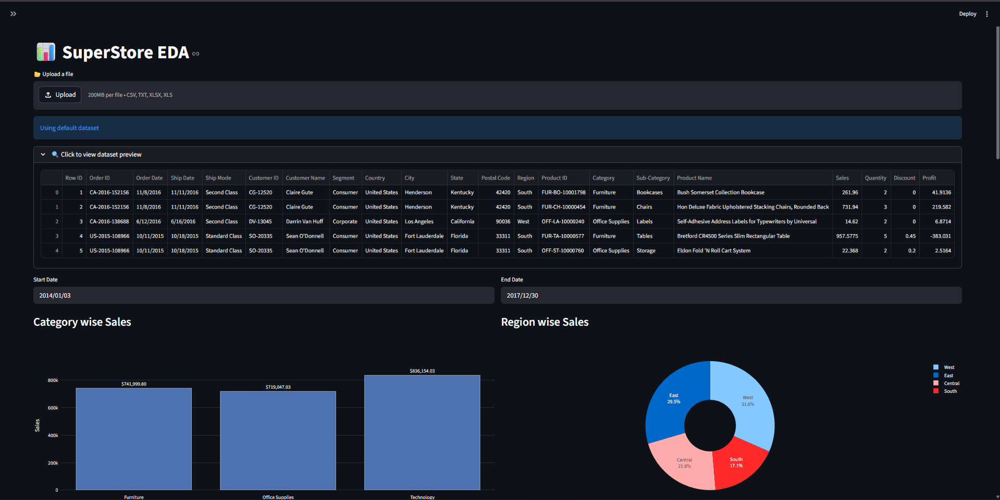

# 📊 SuperStore EDA – Interactive Sales Dashboard


## 🤔 What is this?

This is an **interactive sales dashboard** that helps you explore and understand retail sales data without writing any code. 

**Upload your own sales data** or use the built-in Superstore dataset, then:
- Filter by date, region, state, or city
- See instant charts and insights
- Download any view as a CSV file

Perfect for **sales managers, data analysts, or anyone wanting to quickly visualize sales performance**.

---

## 🎯 What Can You Do With It?

| Feature | What It Shows You |
|---------|-------------------|
| **Category Sales** | Which product categories make the most money |
| **Region Sales** | How different geographic areas compare |
| **Monthly Trends** | Sales patterns across months (seasonality) |
| **Treemap** | Drill from Region → Category → Sub-Category |
| **Sales vs Profit** | Are your sales actually profitable? |
| **Segment Analysis** | Which customer types spend the most |

All charts update **instantly** when you apply filters.

---

## 🚀 Quick Start (3 Steps)

### 1. Install dependencies
```bash
pip install streamlit pandas plotly
```

### 2. Run the app
```bash
streamlit run app.py
```

### 3. Open your browser
The app opens at `http://localhost:8501`

> **No dataset?** The app loads a sample Superstore file automatically.

---

## 📂 How to Use

### Option A: Use Your Own Data
1. Click **"Upload a file"** at the top
2. Upload CSV, Excel, or TXT files
3. Your data must have columns like: `Sales`, `Profit`, `Region`, `Category`, `Order Date`

### Option B: Explore the Sample Data
- Just run the app – it loads `Superstore.csv` automatically

### Filtering Data (Sidebar)
1. Pick **Regions** (multiple allowed)
2. Pick **States** (updates based on region)
3. Pick **Cities** (updates based on state)

### Date Range (Top of page)
- Select **Start Date** and **End Date** to focus on specific time periods

### Download Results
- Each chart has a **"Download Data"** button below it
- Bottom of page has **"Download Data"** for the full filtered dataset

---

## 📸 What You'll See

```
┌─────────────────────────────────────────────────────┐
│  📊 SuperStore EDA                                   │
│  [File Uploader]                                     │
├─────────────────────────────────────────────────────┤
│  [Start Date]  [End Date]                           │
├─────────────────────────────────────────────────────┤
│  Sidebar                    Main Area               │
│  ├─ Region        ┌──────────────┬──────────────┐  │
│  ├─ State         │ Category Bar │ Region Pie   │  │
│  └─ City          │    Chart      │   Chart      │  │
│                   ├──────────────┴──────────────┤  │
│                   │    Monthly Sales Trend      │  │
│                   ├─────────────────────────────┤  │
│                   │    Treemap (Region→Category)│  │
│                   ├──────────────┬──────────────┤  │
│                   │ Segment Pie  │ Category Pie │  │
│                   ├──────────────┴──────────────┤  │
│                   │    Sales vs Profit Scatter  │  │
│                   └─────────────────────────────┘  │
└─────────────────────────────────────────────────────┘
```

---

## 📁 Files in This Folder

| File | Purpose |
|------|---------|
| `app.py` | The main dashboard code (run this) |
| `Superstore.csv` | Sample data (used if you upload nothing) |
| `requirements.txt` | List of Python packages needed |

---

## 🛠️ Requirements

- Python 3.8 or higher
- Internet connection (first run only, to download packages)

---

## 📤 Export Options

Click any **"Download Data"** button to save as CSV:
- Category summary
- Region summary  
- Time series data
- Full filtered dataset

---

## 💡 Common Questions

**Q: My file won't upload**  
A: Make sure it's CSV, Excel, or TXT format. Check that column names match (Sales, Profit, Region, etc.)

**Q: Charts look empty**  
A: Your date range or filters might be too narrow. Try expanding the date range or selecting more regions.

**Q: Can I save my filtered view?**  
A: Yes! Use the "Download Data" button at the bottom to save everything as CSV.

**Q: How do I stop the app?**  
A: Press `Ctrl+C` in your terminal where the app is running.

---

## 🔗 Live Demo (Optional)

If deployed online: [https://your-app-link.streamlit.app](https://your-app-link.streamlit.app)

---

## 📝 Want to Modify the Code?

The entire dashboard is in `app.py` – it's well-commented. Common changes:
- Change colors: Look for `color_discrete_sequence`
- Add new charts: Copy an existing `px.` chart block
- Modify filters: Edit the sidebar `multiselect` sections

---

## ⭐ Like This Project?

Star it on GitHub and share with colleagues who work with sales data!

---


**⚡ From upload to insights — in seconds.**

